My hope is that a standard eventually emerges for rifling inserts to be more or less swappable across flywheel platforms to some degree (FlyCore, Gryphon, HyCon, etc.). It'll likely not be the dimensions outlined in this project, but hey, we have to start somewhere!

# HyCon_muzzleinsert

Variation of torukmakto4's HyCon cage with the addition of rifling inserts - BCAR, PCAR, smoothbore and possible further additions.

  

    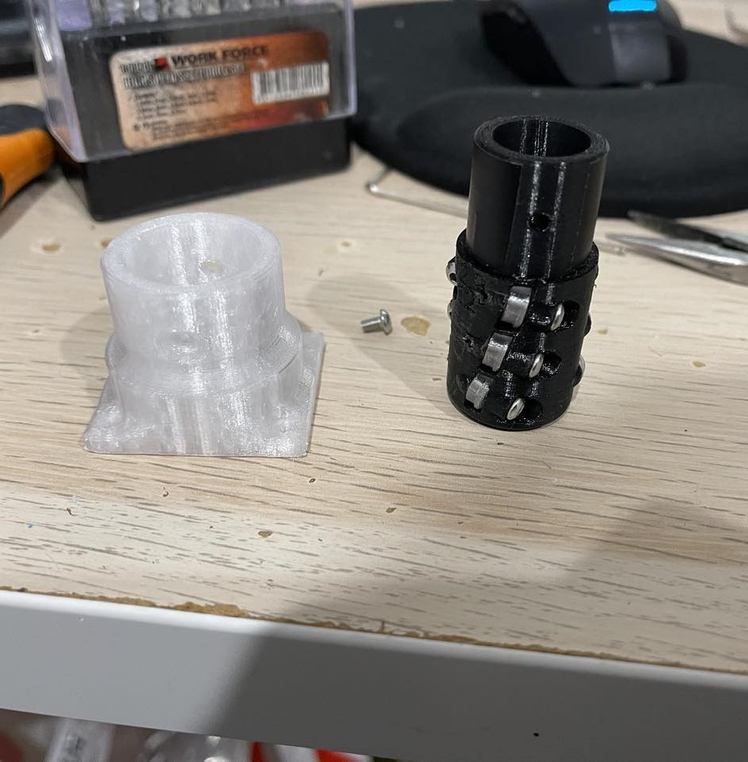
    
Muzzle and BCAR insert

  

  

    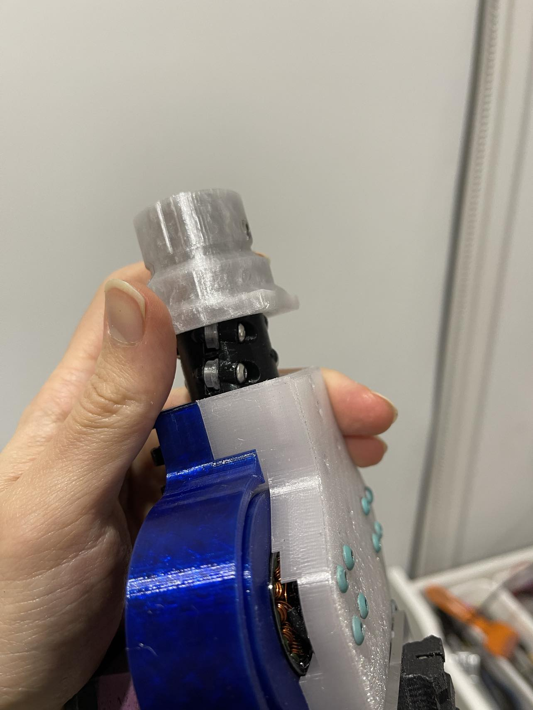
    
Assembling...

  

  

    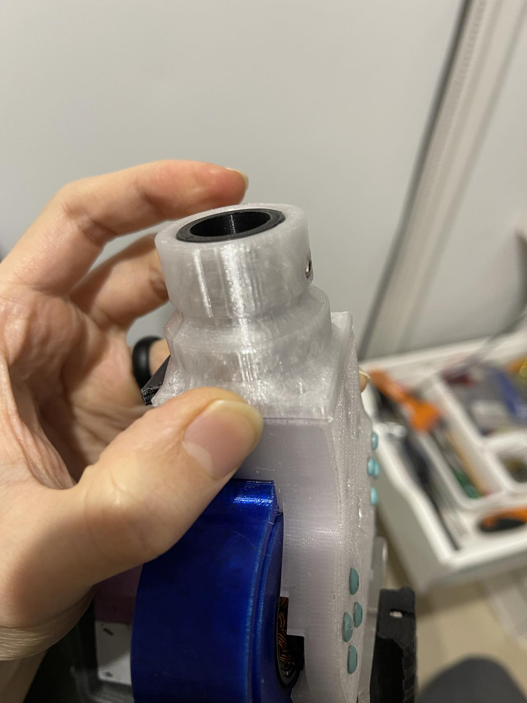
    
Assembled!

  

While the inserts aren't necessary perfectly flushed against the flywheels, I believe them to be in close enough proximity.

  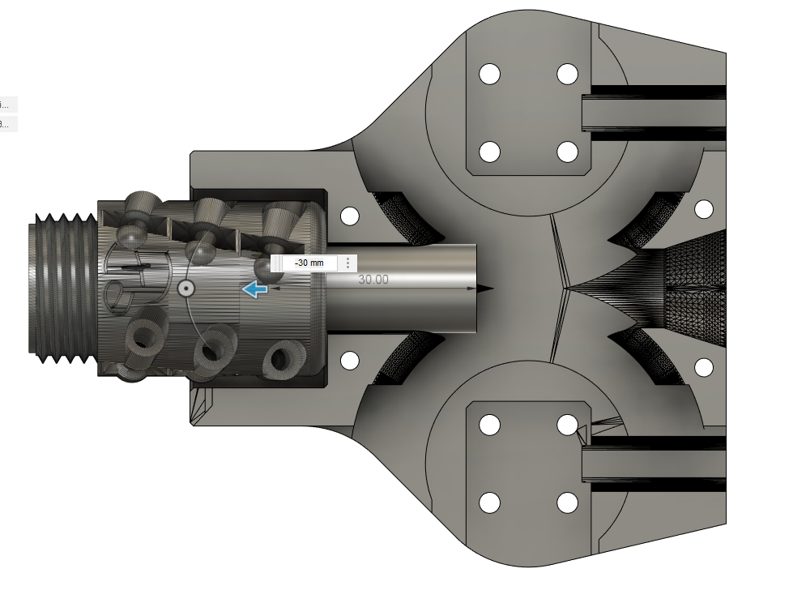
  
Rough fit of insert/cage/dart body (represented by 30mm cylinder)

Unfortunately I've only added an insert version for my QT-19 undercut cage, at some point I'll have to upload a version for the the conventional/main HyCon cage cover. Hopefully the dimensions that I've provided should make it easy enough to reuse my rifling inserts across different platforms though.

  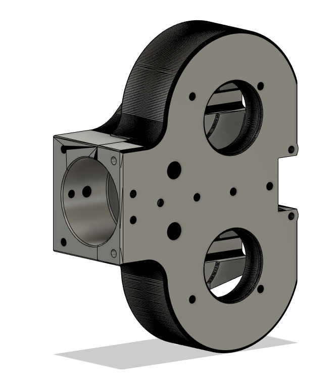
  
Description

## Current inserts:
- Smoothbore 14mm
- BCAR 
    - Bearing Centring And Rifling
    - modified from https://www.printables.com/@Epicxxxx_327692 (12 degree 12.9mm gap)
- PCAR
    - Printed Centring and Rifling
    - 12.9mm gap
    - 12 degrees also to try be consistent with the chosen BCAR for testing consistency

Inserts to make...
- FCAR (TODO)
    - Filament Centring and Rifling
    - I want to try pushing filament into grooves to create rifling, see if the smoother lines improves on the PCAR.
- RCAR (TODO)
    - Rivet Centring and Rifling
    - Cheaper alternative to BCAR
- SCAR (TODO)
    - String Centring and Rifling
    - Done to death in springer circles, surely there's merit in here

## Muzzle dimensions
The muzzle piece holding onto the inserts bolts onto the face of the HyCon cage using 4 M3 SHSC instead of the usual 3 - I had to change this in order to fit the insert. Fortunately the single SHSC was on the cover, not the cage, which likely means less cross compatibility clashes.

  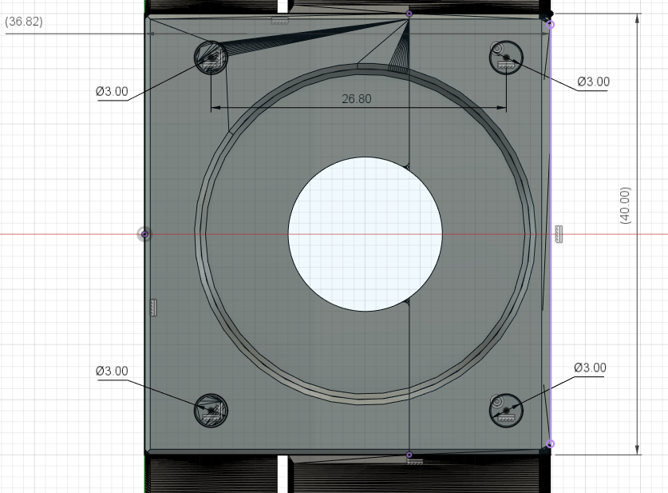
  
Dimensions...

## Insert dimensions

  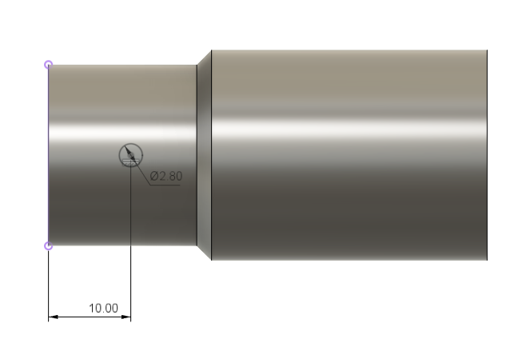
  
Dimensions...

  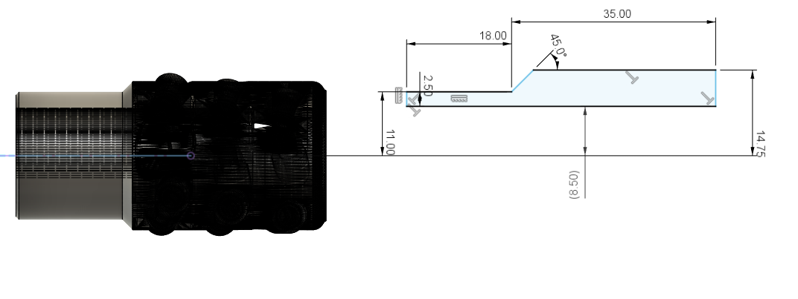
  
Dimensions...

  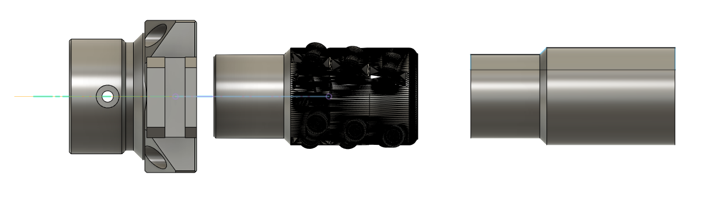
  
Size comparison of BCAR and insert template

## TODO: images to document better

  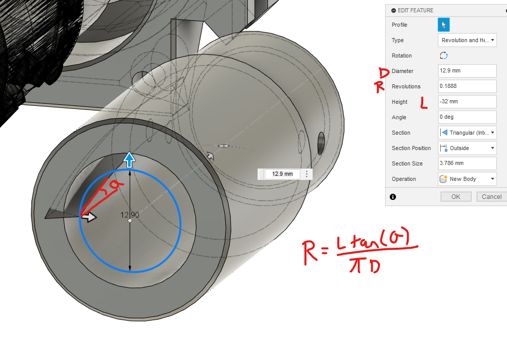
  
Rifling math for Fusion

  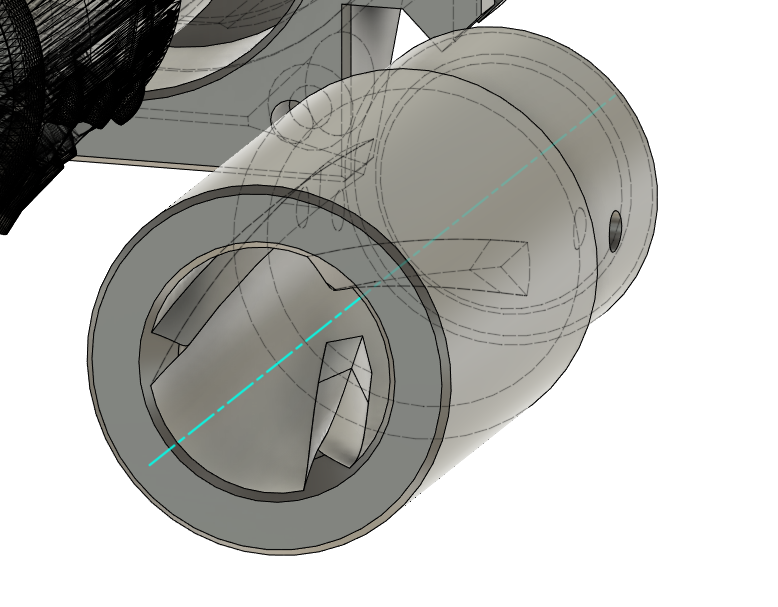
  
First attempt at PCAR insert

